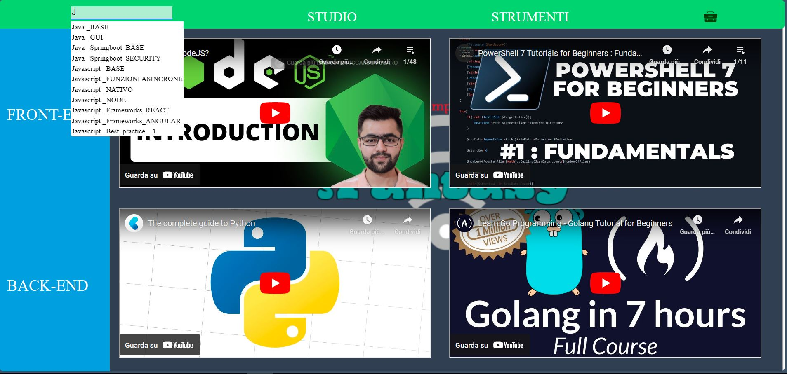

# GUI per Studiare in modo PRODUTTIVO E SELETTIVO 
## esempio per Web_developer

### Possibilita
1. salva i link nel foglio JSON per renderli disponibili nella barra di ricerca
2. rendi veloci gli accessi in altre pagine dal campo nel navbar
3. rendi disponibile nella pagina i video da vedere

### utilizzo e aggiornamenti personalizzati
2. visualizza la cartella */navbar* per sfruttare l'uso dei campi e renderli unici
3. nei file *pagina.js* e *sidebar.js* manipoli i video d accesso rapido

### Futuri aggiormanmenti 
1. aggiungere funzione di fare richieste http e gestirle